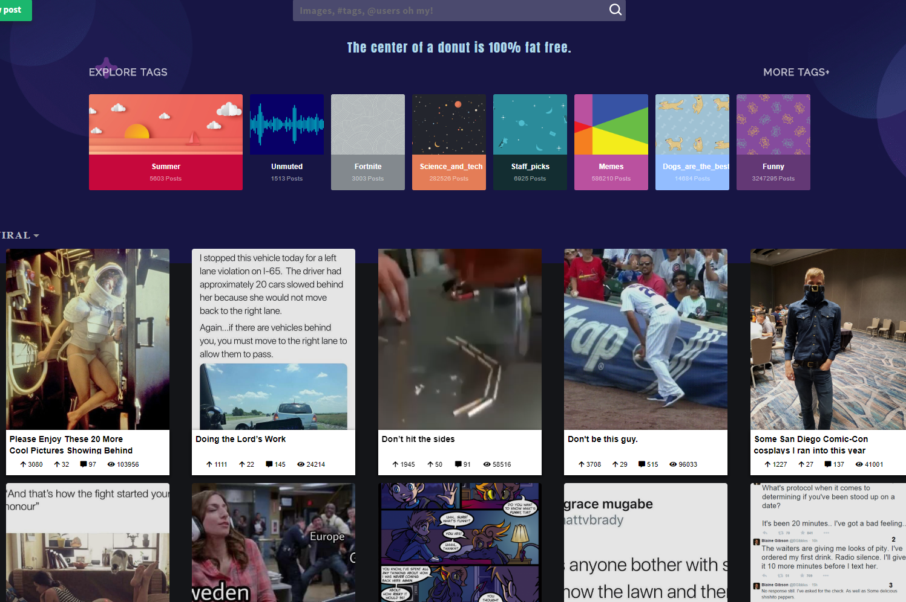
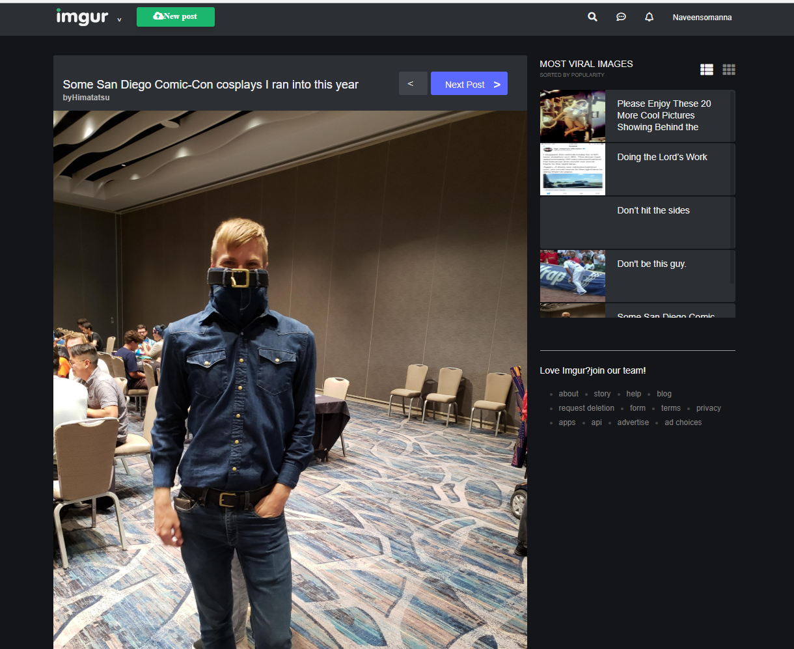

# imgur 
Discover images & videos 




### What's included
| Name             | Description   |
| :-------------:|--------------|
| [React](http://facebook.github.io/react/releases/16.0/) |  Build react Web Apps using JavaScript and React. |
| [React Router](https://github.com/wix/react-router) | Web App-wide support for 100%  navigation with an easy cross-platform interface. |


### Requirements
- [Node](https://nodejs.org/) >= 5.0.0
- [npm](https://npmjs.com) >= 3

### Installation

Clone this repo

```sh
$ git clone https://github.com/naveensomanna/imgur.git
$ cd imgur
$ yarn install or npm install
```


Get api key -
[IMGUR  ](https://api.imgur.com/) -


### How to start
```sh
$ npm start


